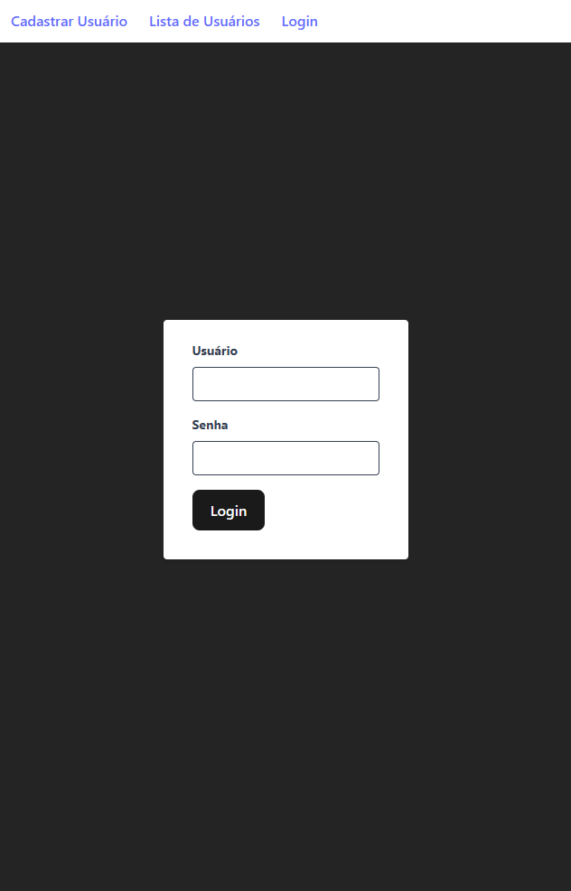
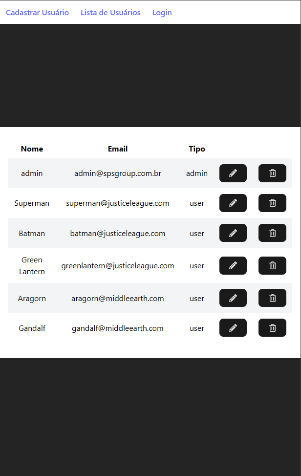
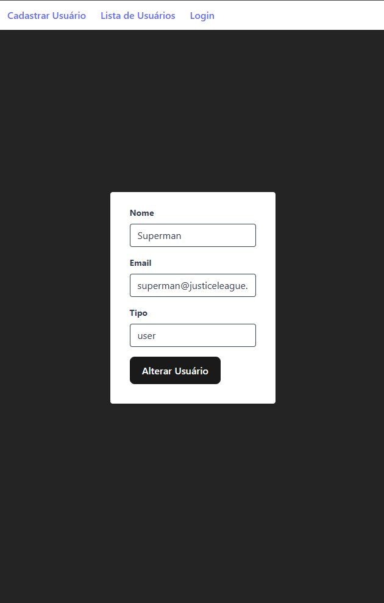

# Cadastro Usuários - Backend

[Tecnologias](#tecnologias) | [Funcionalidades](#funcionalidades) | [Descrição](#descrição) | [Instalação](#instalação) | [Avisos](#avisos) | [Imagens](#imagens) | [Suporte](#suporte) | [Todo](#todo) 

## Tecnologias

<ul>
  <li>Node.js</li>
  <li>NestJS</li>
  <li>Mongoose</li>
  <li>Banco MongoDB</li>
  <li>Jwt</li>
</ul>

[Ir para o topo](#cadastro-usuários---backend)

## Funcionalidades

<ul>
  <li>CRUD de usuário</li>
  <li>Rota pública para baixar token jwt com usuário e senha válidos</li>
  <li>Validação de tokens jwt ja baixados</li>
  <li>Usuários teste pré armazenados no banco de dados</li>
</ul>

[Ir para o topo](#cadastro-usuários---backend)

## Descrição

Backend do projeto Cadastro de Usuários. Descrição do desafio:

Teste NODE

Criar um CRUD (API REST) em node para cadastro de usuários

Para a criação do teste utilizar um repositório fake dos usuários. (Pode ser em memória)

Regras

- Deve existir um usuário admin previamente cadastrado para utilizar autenticação (não precisa criptografar a senha); { name: "admin", email: "admin@spsgroup.com.br", type: "admin" password: "1234" }

- Criar rota de autenticação (Jwt token)

- As rotas da API só podem ser executadas se estiver autenticada

- Deve ser possível adicionar usuários. Campos: email, nome, type, password

- Não deve ser possível cadastrar o e-mail já cadastrado

- Deve ser possível remover usuário

- Deve ser possível alterar os dados do usuário

[Ir para o topo](#cadastro-usuários---backend)

## Instalação

1. Crie uma pasta para o projeto e entre nela
```bash
mkdir cadastro-usuarios 
cd cadastro-usuarios
```

2. Clone o repositório do frontend e entre na pasta criada
```bash
git clone git@github.com:rushxpush/cadastro-usuarios-frontend.git
cd cadastro-usuarios-frontend
```

3. Abra uma outra aba do terminal sem fechar a primeira, entre na pasta cadastro-usuarios, clone o repositório do backend e entre na pasta criada
```bash
git clone git@github.com:rushxpush/cadastro-usuarios-backend.git
cd cadastro-usuarios-backend
```

4. Em ambas abas do terminal abertas, rode o comando abaixo para montar a imagem e rodar o app:
```bash
docker compose up --build
```

5. Acesse a página em [localhost:8000](http://localhost:8000) (Usuário: admin | Senha: 1234)

6. Porta do backend em [localhost:3000](http://localhost:3000)

[Ir para o topo](#cadastro-usuários---backend)

## Avisos

Futuros avisos

[Ir para o topo](#cadastro-usuários---backend)

## Imagens







[Ir para o topo](#cadastro-usuários---backend)

## Suporte

Qualquer dúvida mande um email para [rafagarciadev@gmail.com](mailto:rafagarciadev@gmail.com)

[Ir para o topo](#cadastro-usuários---backend)

## Todo 

- &#x2610; Testes unitários
- &#x2610; Testes e2e 
- &#x2610; Swagger 

[Ir para o topo](#cadastro-usuários---backend)